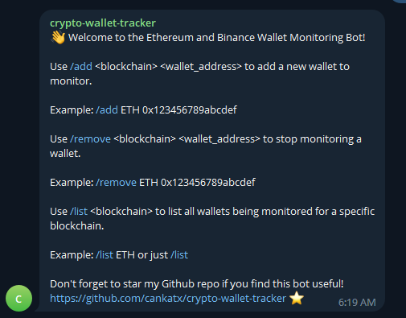
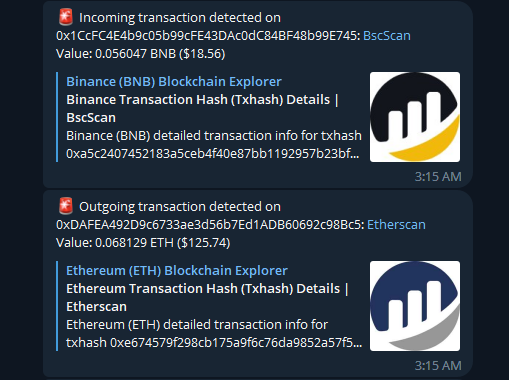
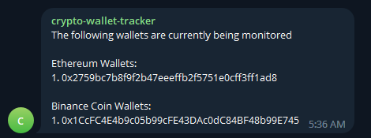

<h1 align="center">
Crypto Wallet Transactions Tracker Bot
</h1>
</p>
<p align="center">
    
     
    <br>
    
    
    <br>
    
    
    <br>
</p>

This is a Telegram bot that tracks the transactions of added Ethereum (ETH) and Binance Coin (BNB) wallets and sends notifications whenever a new transaction occurs. The bot uses the Etherscan and BSCscan APIs to gather information about transactions, and CoinGecko to fetch the current prices of ETH and BNB.

You can contact me for any inquiry; <br>
[](https://t.me/cankat)

## Commands

- `/start` shows a welcome message and instructions on how to use the bot.
- `/add` adds a new wallet to track transactions for. The wallet address must be provided in the correct format (starting with '0x' for ETH wallets and 'bnb' for BNB wallets), otherwise the bot will prompt the user to correct it. The added wallets are saved in a JSON file for persistence.
- `/remove` removes a wallet from the list of tracked wallets. The user must provide the wallet address in the correct format.
- `/list` shows the list of currently tracked wallets.

## Features

- Logging: the bot prompts every transaction and errors.
- Format check: the bot checks that the wallet address provided by the user is in the correct format before adding it to the list of tracked wallets.

## Requirements

To run the bot, you'll need to have Python 3.6 or later installed on your system, along with the following Python libraries:

- `requests` (for making HTTP requests to the APIs)
- `web3` (for interacting with the Ethereum blockchain)

You'll also need to obtain API keys for Etherscan and BSCscan, as well as a Telegram bot token. These can be obtained by following the instructions on the respective websites.

## Installation

1. Clone this repository: `git clone https://github.com/cankatx/crypto-wallet-tracker.git`
2. Install the required packages: `pip install -r requirements.txt`
3. Replace the following placeholders in the `main.py` file with your API keys and bot token:

    ```python
    ETHERSCAN_API_KEY = '<your_etherscan_api_key>'
    BSCSCAN_API_KEY = '<your_bscscan_api_key>'
    TELEGRAM_BOT_TOKEN = '<your_telegram_bot_token>'
    TELEGRAM_CHAT_ID = '<your_telegram_chat_id>'
    ```
4. Start the bot: `python main.py`

## Screenshots

  
  
  
</p>

## Disclaimer

This bot is provided for educational purposes only and should not be used as financial advice. The bot does not have access to your wallet.
